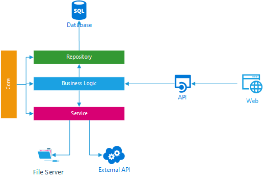
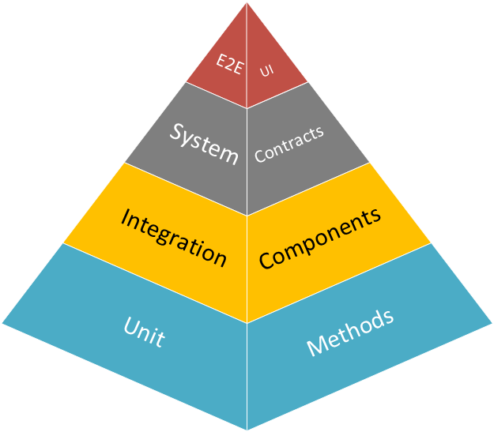
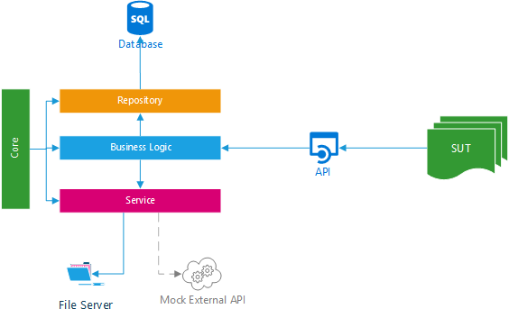
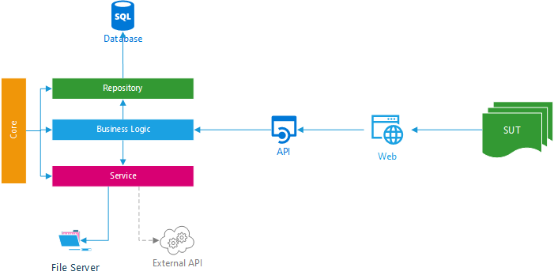

# TestEssentials.ToolKit

TestEssentials.ToolKit are set of libraries for testing all the integrated components which includes Sql Server database, API and UI for . Net Stack.

## Features

* Complete Application Layers.
* Test SQL Server Database which includes Stored Procedures
* Test Identity Authenticate
* WireMock to Mock external api's.
* Workflow or Prioritize XUnit Facts (Test Cases)

## Common Application Architecture

Any application would consist of database, a backend api and fancy UI and with good architecture backend can be further broken into layered architecture. Some cases application consume external apis, perform i/o operation on file server, etc.

## Why do we need testing

An application(s) would always have logic spread across the layers due to architectural reasons or for better performance which makes it more difficult to test using Unit testing. Due to which QA's have to manually do the testing every time a new build is given or write automation tests that work for certain days or these test cases create unnecessary noise.

### Test Pyramid

For smoother development, testing & release of an application(s) test pyramid would give better advantage, For more information, please refer [Martin Flowers](https://martinfowler.com/articles/practical-test-pyramid.html
) article.

## What all we can be tested

* Unit Testing
* Integration Testing
* System Testing
* E2E Testing

## How TestEssentials will help

* Integration Testing
    1. Publish/Create brand new database with all schema & stored procedure.
    2. Using [ASP.Net Core TestServer](https://docs.microsoft.com/en-us/aspnet/core/test/integration-tests?view=aspnetcore-2.2).
    3. Using [WireMock.Net](https://github.com/WireMock-Net/WireMock.Net) to Mock external dependencies.

    

* E2E Testing
    1. Publish/Create brand new database with all schema & stored procedure.
    2. Running ASP.Net Core on Krestal Server
    3. Using [WireMock.Net](https://github.com/WireMock-Net/WireMock.Net) to Mock external dependencies.

    

For Implemantation details refer.

* [Using TestDatabase](https://github.com/muzammilkm/test-essentials/wiki/Using-TestDatabase)
* [Using TestAuthentication](https://github.com/muzammilkm/test-essentials/wiki/Using-TestAuthentication)
* [Using HttpMockServer](https://github.com/muzammilkm/test-essentials/wiki/Using-HttpMockServer)
* [Using TestServer](https://github.com/muzammilkm/test-essentials/wiki/Using-TestServer)

### Advantages

* Test Suite Execution would be Consistent.
* Test Suite can run without actually deploying on server.
* Continuously Improve Quality of Code by refactoring.
* Development & Testing can go hand on hand.
* Incorporate Continuous Integration / Continuous Deployment Pipeline.
* Develop Automation Test Suit.
* Reduce Regression Cycle.
